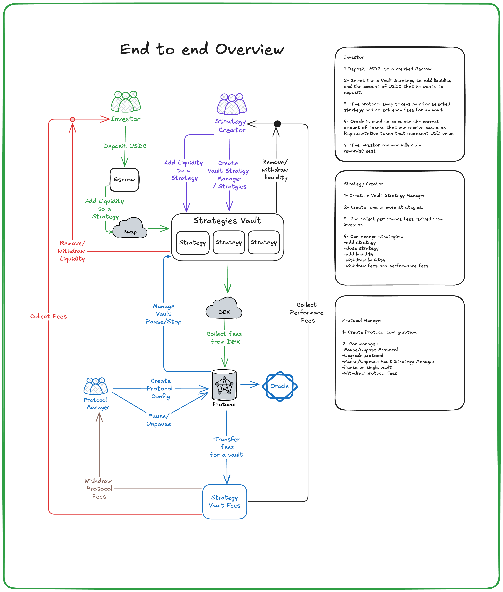

# Tokenized Multi-Strategy Vault

Tokenized Multi-Strategy Vault is a Solana program designed to engage a social layer of investors seeking maximum capital efficiency. It enables users to earn yield by providing liquidity to AMMs across various Web3 protocols. Investors can join the vaults using a single asset, such as stablecoins or SOL.

## Users & Stakeholders

### Direct Users
- **Vault Investors:** Anyone depositing assets (stablecoins) into the vaults to earn yield, from passive beginners to advanced strategy selectors.
- **Strategy Creators:** Individuals or teams who design, build, and propose new yield-generating strategies for the vaults.

### Indirect Users / Beneficiaries
- **Strategy Providers:** The "Strategy Creators" who earn performance fees from their successful strategies.
- **Protocol Treasury / Token Holders:** The entity and individuals who benefit from the platform's share of fees, supporting ongoing development and ecosystem growth.
- **Underlying DeFi Protocols:** AMMs (e.g., Raydium, Orca), lending platforms (e.g., Solend), and other protocols that benefit from increased liquidity and activity directed by the vaults.

### Administrators / Moderators
- **Core Development Team:** Responsible for system development, maintenance, and upgrades.
- **Multisig Signers:** Key individuals responsible for critical administrative actions (e.g., emergency pauses, treasury management).

### Stakeholders
- **Project Token Holders:** Individuals holding the project's native token, with a vested interest in its overall success and utility.
- **Ecosystem Partners:** Other Solana projects (e.g., Jupiter, Pyth) that integrate with or benefit from your vault's presence and TVL.
- **Institutional Investors:** External entities that have provided funding or plan to utilize the vaults at scale.

# Architecture Design

This document provides an overview of the architecture for the Tokenized Multi-Strategy Vault.

[Architecture Design](docs/Architecture-Design.pdf)

## End-to-End Diagram

## Technologies
- **Solana**
- **Rust**
- **Typescript**
